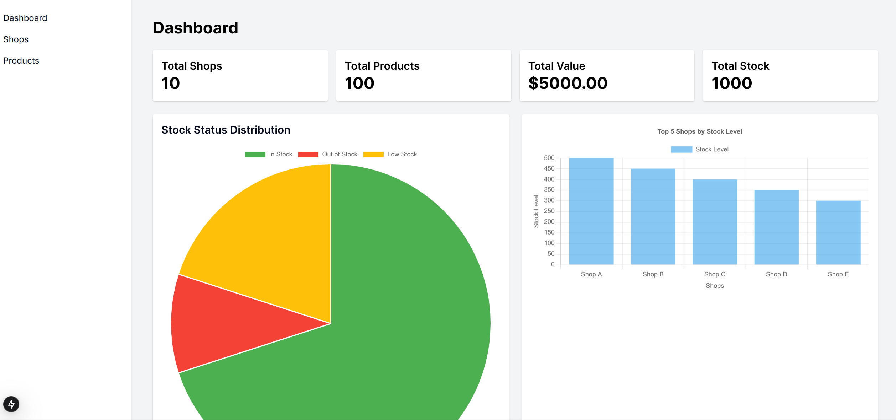
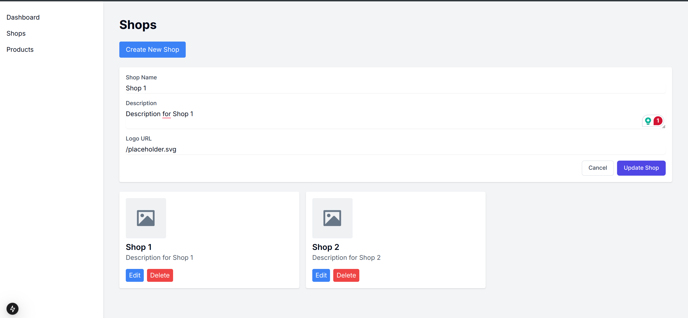

# shopyangu admin dashboard

<p align="center">
  
  
</p>


## Build
The project uses  [pnpm](https://pnpm.io/installation) for dependency management.

### clone project
```sh
git clone https://github.com/andwati/shopyangu-admin-dashboard.git && cd shopyangu-admin-dashboard
```

### install dependencies
```sh
pnpm  install
```

### run the project
```sh
pnpm dev
```

## stack

- [nextjs](https://nextjs.org/) - The React Framework for the Web
- [chart.js](https://www.chartjs.org/) - Simple yet flexible JavaScript charting library for the modern web
- [tailwindcss](https://tailwindcss.com/) - A utility-first CSS framework 
- [shadcn](https://ui.shadcn.com/) - Beautifully designed components that you can copy and paste into your apps. Made with Tailwind CSS. Open source.